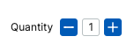

# Quantity Control Dev Challenge

## Task

Build a quantity control to be used on a product or basket page in an e-commerce website. The quantity control should be displayed to the user and usable i.e. they can increment and decrement the value, and it should be custom made and not a HTML input of type number.



## Spec

- The quantity should have a maximum value of 10, a minimum of 0, and a starting value of 1
- The quantity should be able to be increased and decreased

### This Boilerplate

For this task we're providing you with a NodeJS boilerplate with Jest and Webpack installed which will handle running your tests and bundling your JavaScript and HTML.

To serve the contents of the `src` directory run -

```bash
npm start
```

and spin up `http://localhost:9000` to see your page in the browser.

To run the tests -

```bash
npm t
```

## Things to Note

If the user is on a basket page, they could have numerous items in their shopping basket, which means numerous quantity controls would be required. This possibility of the need for multiple instances should be a factor to bear in mind when developing the feature.

We are only interested in the functional logic for the feature, and its integration into a basic UI; its presentation is out of scope for this task. Tailwind is included in the HTML if you want to apply some basic classes to help you develop it but the UX team are still debating the look and feel, so you need to just get the feature working, it can be styled later.

## Feature RoadMap

### Phase One

Deliver the feature as per the spec above.

### Phase Two

Set the initial quantity value upon instantiation, if you haven't already done this as part of phase one (e.g. a user may have added a quantity higher than one to their basket, so the starting value needs to be configurable).

### Phase Three

Output a warning message to the user if they attempt to go above or below the thresholds.

### Phase Four

Set the min and max thresholds upon instantiation (e.g. maybe we have low stock of a particular item so want to limit it to a maximum of five per customer).

## Development Approach

We'd like the development to be considered, methodical and with tests, it would be great if you can use TDD from the start, but it does not have to be approached as a pure TDD exercise if you're not comfortable doing so. We will expect you to use a test runner, and - just to be clear - to **build the feature in vanilla JavaScript, not React**.

Unfortunately, we have a maniacal CTO who expects you to build this feature in a single hour, which means you need to factor that limited time into your development approach. This means you should consider things such as what you decide to test and not to test, which requirements of the feature you focus on and which you don’t etc.
